# Web3Lab3

### Nama: Dimas Riyadh Alfajri
### Nim: 312010029
### Kelas: TI.20.A1
### Matkul: Pemrograman Web 

# Praktikum 3: Membuat List, Table dan Form
## Langkah-langkah Praktikum
   Persiapkan membuat dokumen HTML dengan nama file lab3_tag_dasar.html seperti berikut:

 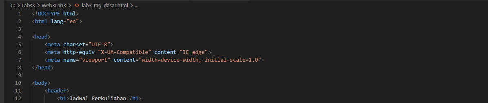

   kemudian jalankan Web Browser dengan mengklik Menu Terminal pada pojok atas pada VS CODE. lihat perubahannya.

 

 ### Membuat Ordered List
   
   kemudian tambahkan kode untuk membuat Ordered List seperti berikut:

 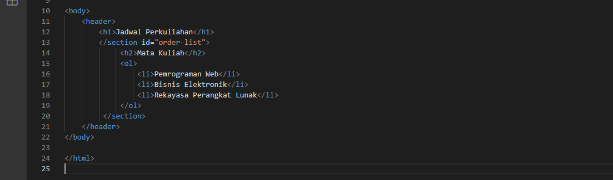

   kemudian lakukan refresh pada web browser, dan Lihat perubahannya:

 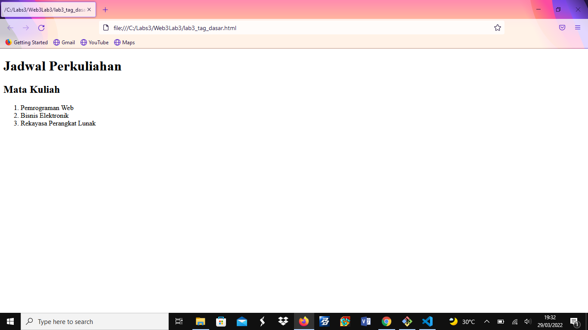

 ### Membuat Unordered List
   
   Kemudian tambahkan code untuk membuat Unordered List, setalah deklarasi Ordered list pada section Unordered-List, Seperti berikut:

 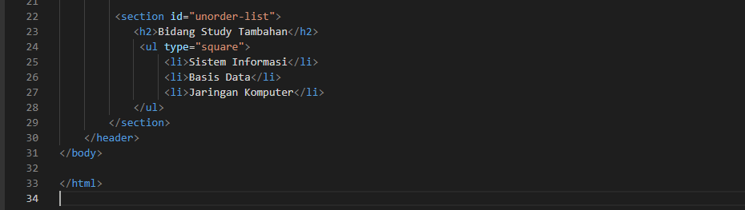

   Lakukan Refresh, dan lihat perubahannya:

 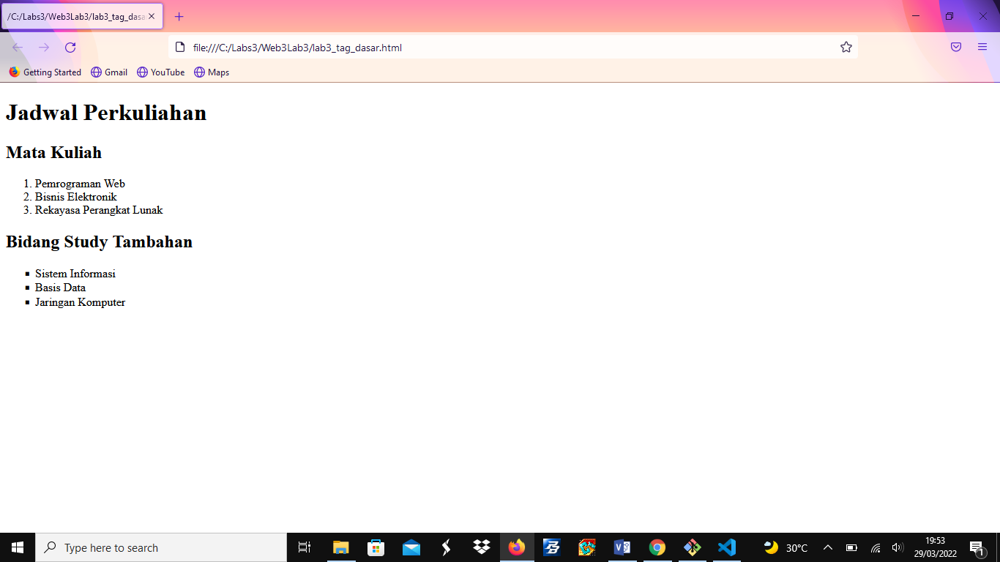

 ### Membuat Description List

   Kemudian tambahkan code untuk membuat description list setelah deklarasi unordered-list:

 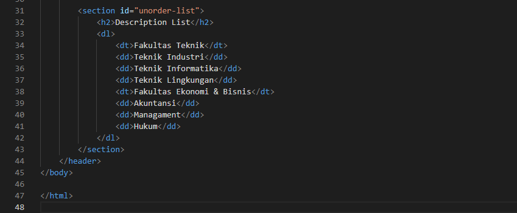

   Refresh Kembali Web Browser, dan lihat perubahannya:

 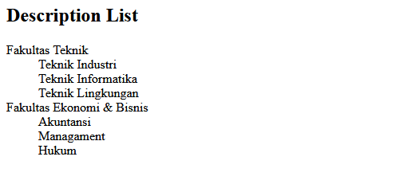

   Selanjutnya lakukan eksperimen lain terkait dengan list dan penggunaan atribut type pada list.

 ### Membuat Tabel - Buat file baru dengan nama lab3_tabel.html seperti berikut ini:

 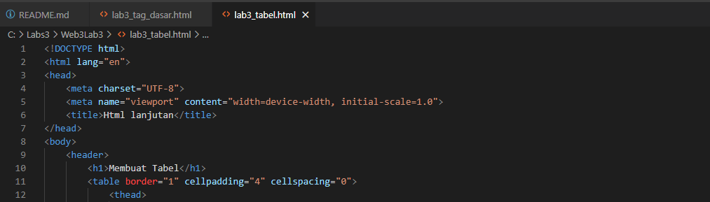

   kemudian selanjutnya tambahkan kode untuk membuat tabel sederhana seperti berikut ini:

 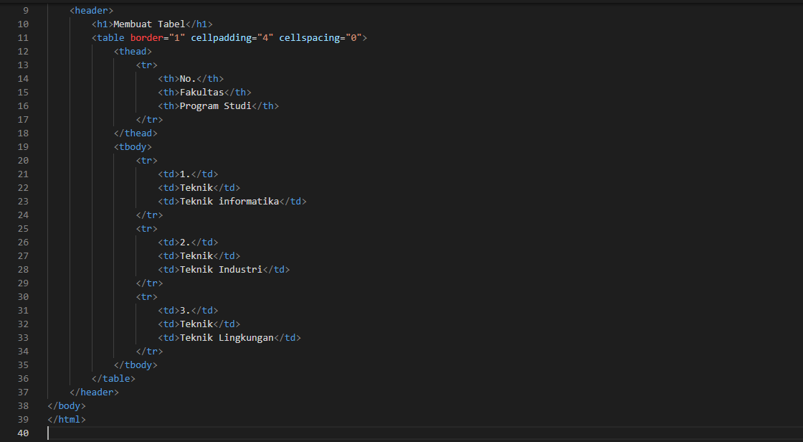

   lalu refresh kembali web browser, dan amati lagi perubahannya:

 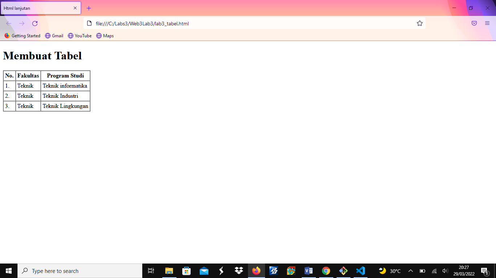

 ### Membuat Form

   Buatlah file baru dengan nama lab3_form.html seperti berikut:

 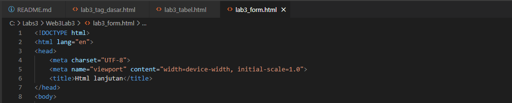

   Kemudian selanjutnya menambahkan kode untuk membuat tabel sederhana seperti berikut:

 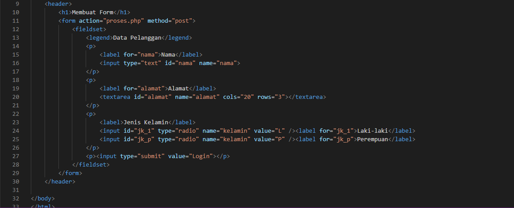
 

